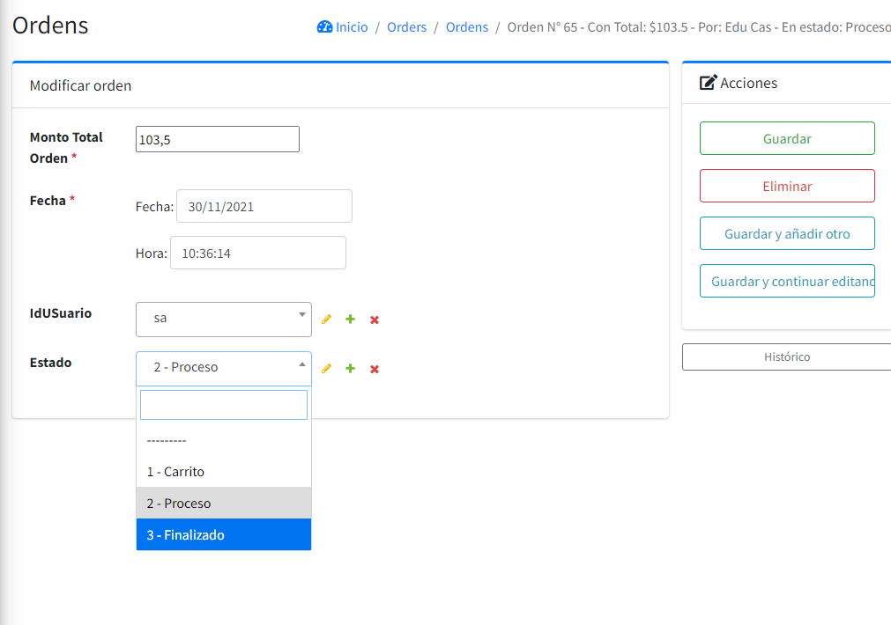

# Project 3 => Pizza

## Elaborado por Eduardo Castellón (C^2)

Bienvenido a mi Project3 de WEB50Xni: ¡Pizza! Una aplicación web basada en la Pizzería Pinocchio's donde podés:

- Como dueño de la pizzería: Agregar productos en tus según las diferentes categorías.

- Como usuario: Ver el Menú con el detalle de las opciones disponibles, registrarte, iniciar sesión, añadir al carrito ordenes, procesarlas y ver su estado desde el historial de ordenes.

## Estructura - Funcionalidad - Descripción

### Scripts

Para le ejecución de éste proyecto se utilizaron los siguientes scripts:

#### Django (Python):

Tenemos 2 módulos, Pizza siendo el módulo principal donde se encuentran los Ajustes del Proyecto y las rutas principales y Orders, donde se opera la lógica operativa del proyecto.

- Desde urls.py configuramos las rutas de cada opción del Sistema.
- Desde views.py se codifica el comportamiento principal de cada vista (Los controladores en MVC).
- models.py donde se escriben los modelos que enlazan la BD a través del ORM de Django.

#### HTML5: 
- Base: HTML que renderiza la plantilla Index en su interior que contiene las referencias de todos los estilos CSS y Scripts JS.
- Login: HTML independiente para iniciar sesión.
- Logged_out: HTML que muestra la vista de despedida por sesión cerrada.
- Register: HTML para registro de usuarios.
- Accounts/Index: HTML de carrito de compras.
- Orders/Index: HTML del menu de opciones.
- History: HTML donde se podrá ver el historial de ordenes.

#### SCSS:
- login.scss
- main.scss

#### Base de Datos (en SQLite):

Diagrama de Clases para las relaciones entre clases del Sistema.

### Menú

La aplicación ofrece una pantalla visible del menú divido en categorías para todos los usuarios (autentificados y no autentificados).

### Agregando Items

A través de la vista de Administración se podrán agregar items.

### Registro, Login, Logout

Utilizando la Autenticación de Django a través de vista personalizada, se podrá registrar iniciar y cerrar sesión.

#### Registro

#### Login

#### Logout

### Carrito de Compras

Al entrar a la vista de compras se podrá ver una pantalla donde podrás agregar items, si no existe una orden activa el sistema lo valida y genera una orden nueva en la cual se agregan todas las opciones deseadas.

Ejemplo nuevo item

Se guarda en la BD bajo el Estado de 'Carrito' donde a través tambien de otra tabla se registra la orden actual en carrito de cada usuario con el fin de que si esa orden no se ha procesado permanezca en el carrito hasta ser procesada.

### Colocar una orden

Al decidir colocar la orden, se debe seleccionar 'Procesar Orden' que muestra una ventana con el total por pagar y si está seguro de querer validar la orden.

Y al tocar en validar el Estado de esa orden pasa a ser 'En Proceso' que significa que su orden se está preparando.

### Ver Órdenes

Desde el admin del sistema se pueden ver las ordenes con su usuario, el total y el estado en que se encuentra

### Toque Personal

#### 1. Ver Historial de Ordenes

A través de esta vista se podrán ver que ordenes se encuentran en proceso y que ordenes fueron finalizadas.

#### 2. Cambiar Estado de Órdenes

Una vez preparada la pizza y entregada desde el admin se podrá editar la orden en finalizada y en el historial de cada usuario se verá el cambio.

#### 3. Contador de Preferidos

Desde el Menú tambien se podrá visualizar la cantidad de veces que cada opción se ha pedido, ordenandose de mayor a menor según su categoría.

#### 4. Imágenes en el menú (Apreciable en fotos anteriores)

#### 5. Pizzas Especiales tienen máximo 5 toppings